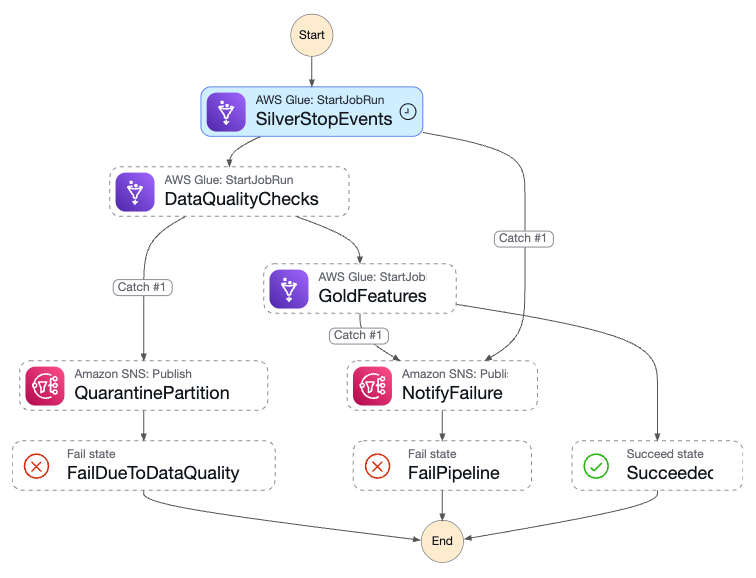
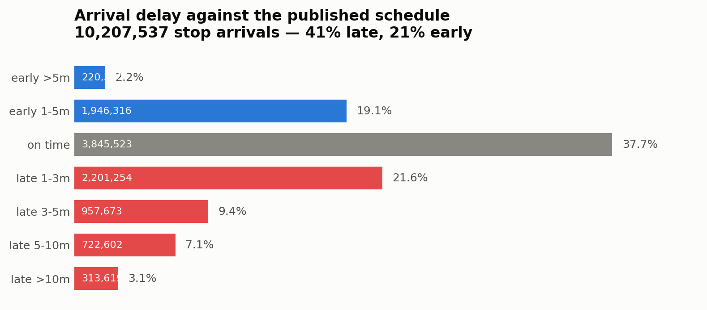
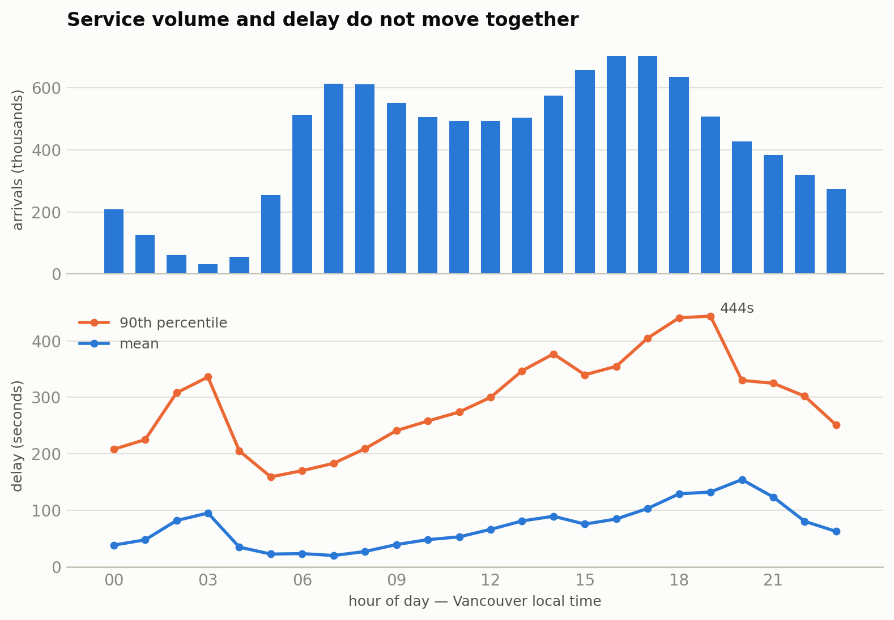

# TransitPulse BC

Real-time transit delay prediction on AWS: streaming GTFS-Realtime ingestion, an
S3 lakehouse, and an XGBoost delay model, all provisioned by Terraform, deployed
through GitHub Actions, and watched nightly by a read-only LLM agent that files
its own operations report.

> Transit data from TransLink, used under their Open API Terms of Use.
> Weather data from Open-Meteo.

## Status

<!-- agent:status:begin -->
**As of 2026-08-29, the data half is in production and the model half is not.**

| Stage | State |
|---|---|
| Ingestion, bronze, silver, gold | running continuously |
| Nightly ETL | running continuously (last execution SUCCEEDED) |
| Nightly ops agent | running |
| Training, evaluation, model registry | provisioned in Terraform, never run |
| Inference endpoint, prediction API | infrastructure live, no model behind it |

Nothing is trained yet, so no model has been registered and no endpoint exists. Phase 5 splits train/validation/test by time, which needs 21 distinct service days; **18 are collected**, 3 to go.

Gross usage on 2026-08-28 was **$1.06**, a $1.05/day median over the last three days (≈$33/month at that rate).
<!-- agent:status:end -->

The MAE figures below are **baselines computed from collected data**, not model
results, and they are what the model will have to beat.

Collection is deliberately paced rather than rushed. Progress: `make data`.

> Figures in this README between `agent:*:begin` and `agent:*:end` markers are
> regenerated daily from live queries by the docs agent
> ([`docs/agent.md`](docs/agent.md)). Edit the queries in
> [`sql/07_profile_queries.sql`](sql/07_profile_queries.sql), not the numbers.

## Results

### Baselines, measured

<!-- agent:baselines:begin -->
Over 10,207,537 labelled stop arrivals, 2026-08-11 to 2026-08-28. **Preliminary**: too few days to cover a weekend, rain, or an incident. Figures come from `sql/07_profile_queries.sql`.

| Predictor | MAE (seconds) |
|---|---|
| Published schedule (predict zero delay) | **153.8** |
| Persistence (bus stays as late as it currently is) | **135.0** |
| Historical median for route/stop/hour | see `sql/07_profile_queries.sql` query 4 |
| **XGBoost model** | pending, Phase 6 |

Persistence beats the printed timetable by 12.2%. The registry gate is `mae_ratio_vs_persistence <= 0.92`, so a model must reach **≤ 124.2 seconds** to be registered at all.
<!-- agent:baselines:end -->

That persistence number is the honest bar. "A bus four minutes late tends to stay
four minutes late" is a hard baseline, and a model that only ties it is a real
finding rather than a failure to hide. A gate that always passes is decoration.

The historical-median baseline needs `hist_median_delay`, which requires ≥20
observations per route/stop/day-type/hour cell from *strictly earlier* service
dates. That is the leakage guard, and it means the feature is empty until roughly
day five.

All measured on a time-based hold-out split, never random. A random split leaks
the future through the historical aggregates and makes every metric fraudulent.

## Architecture

EventBridge → Lambda poller → Kinesis Data Streams → Firehose → S3 bronze → Glue
PySpark (bronze → silver Iceberg → gold) → SageMaker Pipeline (train → evaluate →
quality gate → registry) → Serverless Inference endpoint → Lambda → API Gateway.

Everything up to and including gold runs nightly today. Everything from the
SageMaker Pipeline onward is provisioned and waiting for a training window.

Two branches of that diagram are switched off on purpose:

- **The DynamoDB online-feature path** (Kinesis → Lambda → DynamoDB) has its event
  source mapping disabled. Nothing reads it during collection, because training
  data comes entirely from S3, and it was 49% of the bill. It has to be re-enabled
  before an endpoint is deployed.
- **The prediction API** is live at the infrastructure level, Lambda and API
  Gateway both, but there is no inference endpoint behind it yet.

### ETL orchestration



The nightly ETL is a Step Functions state machine, not a chain of cron jobs. The
detail worth noting is that **data quality failure and infrastructure failure
take different branches**:

- `DataQualityChecks` exits non-zero → `QuarantinePartition` → the gold layer is
  never rebuilt, the bad partition stays inspectable in S3, and an SNS alert
  fires. Bad data cannot reach training.
- Any other task failing → `NotifyFailure` → `FailPipeline`.

Both are failures, but they are different problems and deserve different
responses. Treating them identically would either crash the pipeline on
recoverable data issues or silently promote bad data on a retry.

Decisions and their trade-offs are recorded in `docs/adr/`.

## What the data looks like

<!-- agent:dataprofile:begin -->
10,316,878 stop arrivals over 18 days of collection (2026-08-11 to 2026-08-28), label completeness 0.989.
<!-- agent:dataprofile:end -->

The charts below are regenerated daily from
[`sql/07_profile_queries.sql`](sql/07_profile_queries.sql); run
`python scripts/plot_profile.py` to redraw them by hand.



Buses run late more often than early, but the distribution is wide in both
directions: 23% of arrivals are more than a minute *ahead* of schedule. That is
why the model predicts signed delay rather than lateness, and why `clamp_delay()`
has a floor of −1800 seconds rather than zero.



The 46× swing in arrivals between 3am and the afternoon peak is the feed
reflecting how many buses are actually on the road. The second panel is the
interesting one: **volume and delay do not move together.** The busiest hours are
not the worst ones, and the quietest hour of the night carries a higher mean delay
than the morning rush.

Volume and delay are plotted on separate stacked axes rather than a shared one,
because a dual-axis chart lets you imply any correlation you like by sliding the
scales.

> **This chart found a bug.** `hour_of_day` is derived from `observed_arrival_ts`,
> which is UTC, but `PEAK_HOURS = {7, 8, 15, 16, 17}` was written for local hours:
> midnight, 1am, and mid-morning in Vancouver. Meanwhile the serving path computes
> its hour from `now + LOCAL_OFFSET` before calling the same `is_peak_hour()`.
> Training reads UTC, serving reads local: seven hours apart for the same bus.
> Textbook training/serving skew, caught by plotting the data rather than by a test.

## Repository layout

| Path | Contents |
|---|---|
| `infra/` | Terraform: 8 modules, root composition, dev/prod tfvars |
| `src/common/features.py` | The feature contract shared by training and serving |
| `src/ingest/` | Poller (zip), static GTFS loader, online feature writer |
| `src/glue/` | PySpark ETL: silver, gold, data quality, backtest |
| `src/ml/` | SageMaker training, evaluation, pipeline, deploy |
| `src/serving/predict/` | Prediction Lambda behind API Gateway |
| `sql/` | Athena DDL, baseline query, phase verification queries |
| `tests/` | Unit tests plus the training/serving parity guard |
| `scripts/` | Bootstrap, image build, backfill, daily health check |
| `agent/` | Ops agent: supervisor, four subagents, 18 read-only tools |
| `reports/` | One agent report per day, committed by the nightly workflow |

## Quick start

```bash
make lint test          # runs offline, no AWS needed
./scripts/bootstrap.sh  # one-time state backend
make package            # build the poller as an 868 KB zip, no Docker
make init plan apply
```

The poller ships as a zip rather than a container. `pip --platform
manylinux2014_x86_64` cross-builds Linux wheels from macOS, so the same command
produces an identical package on Apple Silicon and Intel: 868 KB instead of a
~600 MB image, and no Docker daemon. `make image` still exists if you set
`poller_package_type = "Image"`.

Day-to-day operation is in [`docs/daily-runbook.md`](docs/daily-runbook.md):
`make check` for service health, `make data` for collection progress. Both are
also run nightly, unattended, by [the ops agent](#the-ops-agent).

## Production considerations

- **Data quality gate.** Bad partitions are quarantined and the gold layer is
  left untouched, rather than crashing the pipeline or poisoning training data.
- **Point-in-time correctness.** Historical aggregates use strictly earlier
  service dates; the split is time-based, never random.
- **Training/serving parity.** One feature module, one set of null-fill
  defaults, and a test that fails when the two paths diverge.
- **Late-arriving ground truth.** A daily backtest job joins captured predictions
  to observed outcomes and publishes rolling MAE to CloudWatch. Written and
  deployed, but not yet exercised: there are no predictions to backtest until an
  endpoint exists.
- **Cost control.** No NAT Gateway, serverless inference, S3 lifecycle rules,
  explicit log retention, and a billing alarm that disables ingestion.

## Cost

**~$21/month at current ingest volume**, measured rather than estimated. It did
not start there. The first days ran at ~$4/day, and getting it down meant reading
an itemised bill rather than trusting an architecture diagram.

| Change | Why |
|---|---|
| Disabled the online-feature path until serving | Nothing reads DynamoDB during collection; training data comes entirely from S3. It was 49% of spend. |
| Pack ~100 rows per Kinesis record | Firehose bills every record rounded up to **5 KB**, and rows are ~200 bytes, so unpacked it billed 57 GB/day against 2.3 GB of real data. |
| Poll every 2 min instead of 1 | Silver emits one row per *arrival* regardless of how often it was re-predicted, so this halves cost for the same number of training rows. |
| Daily ETL instead of hourly | 72 → 3 Glue runs/day, for data a weekly retrain consumes. |
| No NAT Gateway | Two free gateway VPC endpoints replace a ~$32/month appliance. See [`adr/003`](docs/adr/003-no-nat-gateway.md). |
| Serverless inference chosen over a provisioned endpoint | ~$0 idle versus ~$96/month for the smallest always-on endpoint. See [`adr/004`](docs/adr/004-serverless-inference.md). |

The Kinesis shard is the only component that bills while idle, at ~$0.36/day.
Everything else genuinely scales to zero, which is why the current bill is almost
entirely that shard.

## The ops agent

A supervisor and four specialists run at 03:30 UTC, inspect the running pipeline
and commit a report to [`reports/`](reports/). LangChain on Groq, traced in
LangSmith, deployed as a scheduled GitHub Actions workflow, so it runs whether or
not a laptop is open.

| Agent | The question it answers |
|---|---|
| infrastructure | Is it running? Alarms, EventBridge rules, Kinesis/Firehose, Lambda + DLQ, Step Functions, Glue |
| cost | Is it spending more than it should, and on what? |
| data quality | Is the output usable for training? Collection progress, label rate, duplicates |
| code | Does any of that trace to a defect in this repo? |
| supervisor | Compiles the four and writes the report |

The decision worth defending is that **the subagents do not compute anything.**
Every number in a report came from a boto3 or Athena call, threshold comparisons
and the month-end projection happen in Python, and the supervisor carries findings
through verbatim. The only free prose is the two-sentence summary at the top. A
model having an off day makes that summary bland; it cannot invent a cost figure
or silently drop a critical finding.

It is read-only by construction: a dedicated IAM role with an explicit `Deny` on
every mutating action, an Athena tool that rejects anything but `SELECT`, and repo
tools that cannot escape the working tree. That matters more than it first appears,
because the agent reads CloudWatch logs, which carry data derived from an external
feed and are therefore a real prompt-injection channel. Injection cannot be
reliably prevented by prompting, so the blast radius is constrained instead: the
code agent proposes patches as a **draft pull request** and is structurally unable
to apply one.

Each run is a single LangSmith trace: four subagents, every model call and every
tool call nested under one root span, stamped with the git SHA and the thresholds
in force. The report says what the agent concluded; the trace is how you check its
working, and its URL is in the report footer.

```bash
make agent-tools   # exercise every tool against AWS, no model, no tokens spent
make agent         # full run, writes reports/<today>.md
```

Running it costs effectively nothing: Groq free tier, ~5 minutes a day of Actions
minutes, and metric reads. That was a design constraint rather than a happy
result, because an observability layer costing more than the ~$0.70/day pipeline
it watches is a bad trade. Details in [`docs/agent.md`](docs/agent.md).

## Known limitations

- **No model exists yet.** Training, evaluation, the registry gate and the
  endpoint are written and provisioned but have never run, because a time-based
  split needs 21 service days and 2 are collected. Every number under Results is
  a baseline, not a result.
- The SageMaker execution role uses `AmazonSageMakerFullAccess` for development.
  A production deployment would scope this down.
- One Kinesis shard caps writes at 1,000 records/sec. At ~16,000 rows per poll the
  poller exceeded that, Kinesis throttled, invocations failed and polls were lost
  to the DLQ. Resolved by pacing `PutRecords` batches to ~900/sec inside the Lambda
  rather than provisioning a second shard: the function has a 120-second timeout
  and was finishing in 4.5, so the capacity was already paid for. A second agency
  would need a real second shard.
- Iceberg small files will need periodic compaction beyond a few months of data.
- The ops agent has no memory between runs, so a slow drift that never breaches a
  daily threshold is invisible to it. Worse, nothing alerts when the *workflow
  itself* fails to fire. Absence is silent, which is precisely the class of bug
  the agent was written to catch in the ETL. A dead-man's-switch is the fix.
